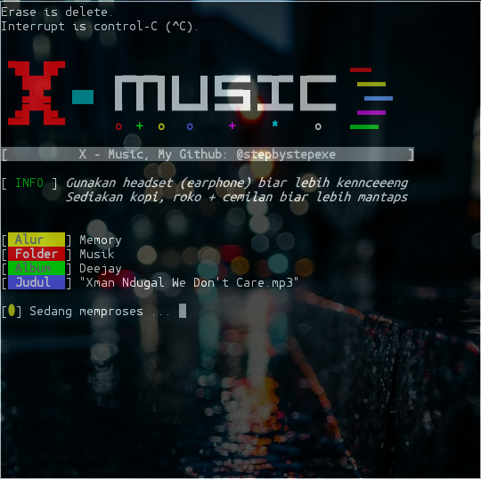

# X-Music
*X-Music adalah layanan streaming musik dan lemari musik daring yang dioperasikan oleh Stepbystep. Pengguna dapat mengunggah dan mendengarkan hingga 1trilon lagu tanpa biaya.*
#### Screenshot:

#### Cara Menginstall:
```
pkg update && pkg upgrade
apt-get install git
apt-get install python
git clone https://github.com/stepbystepexe/X-Music
cd X-Music
ls
python2 x-music.py
```
#### Audio:
Untuk memutr musik install ```mpv```
#### Kontak:
+ Email d_q16x@outlook.co.id
+ WhatsApp https://tinyurl.com/wel4alo
#### Paypal:
+ Onclick https://bit.ly/3dcEQcN
#### LiberaPay:
<noscript><a href="https://liberapay.com/stepbystepexe/donate"></a></noscript>
>**Created by Nedi Senja**
